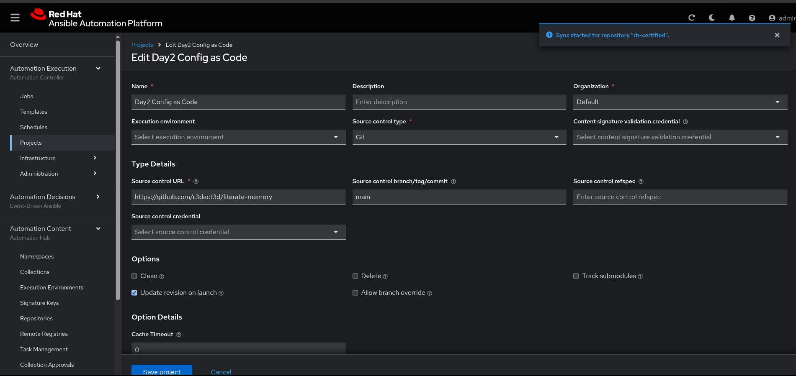
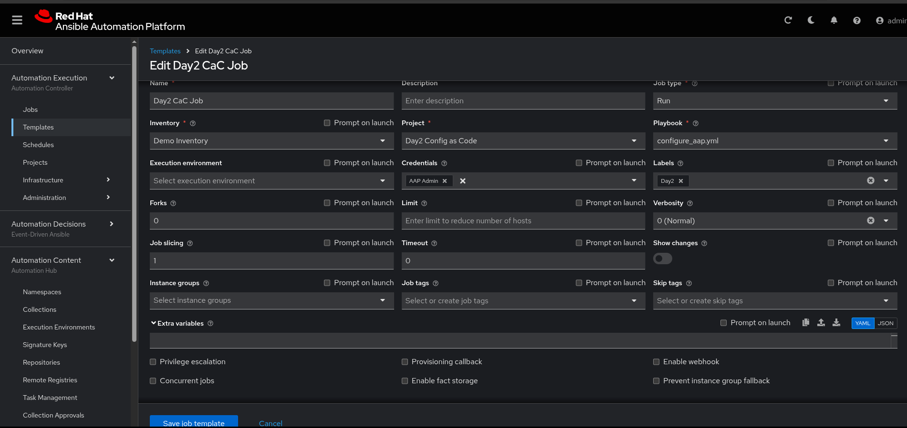

# AnsibleProject

## Organize Your Repository

Setup dedicated repository for your ansible projects, which includes playbooks, roles, and inventories. You might want to have a structure like this:

.Directory Structure
```
.
├── .github/workflows
├── collections
│   └── requirements.txt
├── controller_configs
│   ├── all
│   ├── controller
│   ├── pah
│   └── eda
├── inventory.yml
└── controller_config.yml
```

## Setup

There are a few things we can do in the Ansible Automation Platform console GUI to setup for configuration as code.

### Automation Content

1. Update the *rh-certified* **Remotes** 
   - Add your [Automation Hub Token](https://console.redhat.com/ansible/automation-hub/token)
   - Update the YAML requirements with below cellections
```yaml
collections:
  - name: ansible.platform
  - name: ansible.hub
  - name: ansible.eda
  - name: ansible.controller
```


2. Under **Repositories** sync the repository named *rh-certified*
   


### Automation Execution

1. Create **Credential** called *AAP Admin*

This credential will provide the Ansible Automation Platform hostname, username, and credentials that will be passed to the job template.

   

## Function

4. Create a **Project**



5. Create a **Template**




[Red Hat Validated Collection infra.aap_configuration](https://github.com/redhat-cop/infra.aap_configuration)
